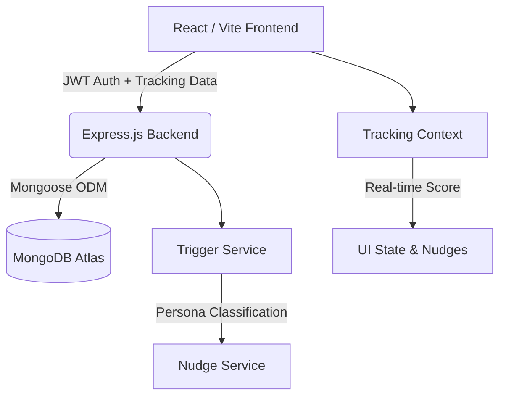

# Fidelity Investor Intent Intelligence Engine 🚀

> **Detect hesitation. Recover intent. Increase conversions.**
> *A full-stack behavioral intelligence platform predicting drop-offs before they happen.*

---

## 📖 Overview
The Fidelity AI Engine is a state-of-the-art hackathon project designed to monitor micro-interactions (page dwell times, exit intents, compare clicks) and classify users into real-time psychological personas. When a drop-off risk is detected, the engine triggers hyper-personalized, explainable AI nudges to recover the conversion.

---

## ✨ Core Features
- **🕵️ Silent Behavioral Tracking**: Context-aware monitoring of user journeys without impacting UI performance.
- **🧠 Real-Time Persona Detection**: Instantly classifies users (e.g., 'Confused Beginner', 'Window Shopper').
- **💬 Explainable AI Nudges**: Generates contextual WhatsApp and Email nudges based on strict behavioral scoring.
- **📊 Admin Control Center**: A comprehensive React dashboard featuring Conversion Funnels, Persona Distributions, and Live Activity Feeds.
- **💳 Secure Checkout Modal**: A fully mocked, glassmorphic investment flow demonstrating intent capture.

---

## 🏗️ Architecture



### Tech Stack
- **Frontend**: React 18, Vite, Tailwind CSS v3 (JIT), Recharts, Lucide React
- **Backend**: Node.js v24, Express, Mongoose, JWT, bcryptjs
- **Database**: MongoDB Atlas (Cloud)

---

## ⚙️ Setup & Installation

### 1. Clone the repository
```bash
git clone https://github.com/your-username/fidelity-ai.git
cd fidelity-ai
```

### 2. Configure MongoDB
You need a MongoDB Atlas cluster.
1. Create a cluster at [mongodb.com/cloud/atlas](https://mongodb.com/cloud/atlas).
2. Whitelist your IP (`0.0.0.0/0` for hackathon purposes).
3. Get your connection string.

### 3. Environment Variables
Create a `.env` file inside the `backend/` folder:
```env
MONGO_URI=mongodb+srv://<user>:<password>@cluster.mongodb.net/FidelityHack
JWT_SECRET=super_secret_jwt_key_fidelity_ai_2026
PORT=5000
```
Create a `.env` file inside the `frontend/` folder:
```env
VITE_API_URL=http://localhost:5000/api
```

### 4. Install Dependencies & Run
**Backend:**
```bash
cd backend
npm install
npm run dev
```

**Frontend:**
```bash
cd frontend
npm install
npm run dev
```

---

## 📡 API Documentation

### Authentication
- `POST /api/auth/register` - Creates a new user.
- `POST /api/auth/login` - Authenticates user & returns JWT.

### Tracking & Nudges
- `POST /api/events` - Logs a behavioral event.
- `POST /api/score/compute` - Aggregates events into a Persona Score.
- `POST /api/nudges/generate` - Invokes AI trigger logic to spawn a nudge.
- `POST /api/email-logs` - Persists the triggered nudge to the database.

### Investments
- `POST /api/investments` - Completes a secure checkout flow.

### Admin
- `GET /api/admin/analytics` - Returns global conversions, stats, and an enriched user table.

---

## 🚀 Deployment

**Frontend (Vercel)**:
1. Connect GitHub to Vercel.
2. Set Root Directory to `frontend`.
3. Add Environment Variable: `VITE_API_URL=https://your-backend-url.onrender.com/api`

**Backend (Render)**:
1. Connect GitHub to Render.
2. Root Directory: `backend`
3. Build Command: `npm install`
4. Start Command: `npm start`
5. Add `MONGO_URI` and `JWT_SECRET` variables.

---

*Built with ❤️ for the Fidelity Hackathon 2026*
